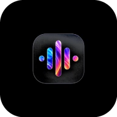
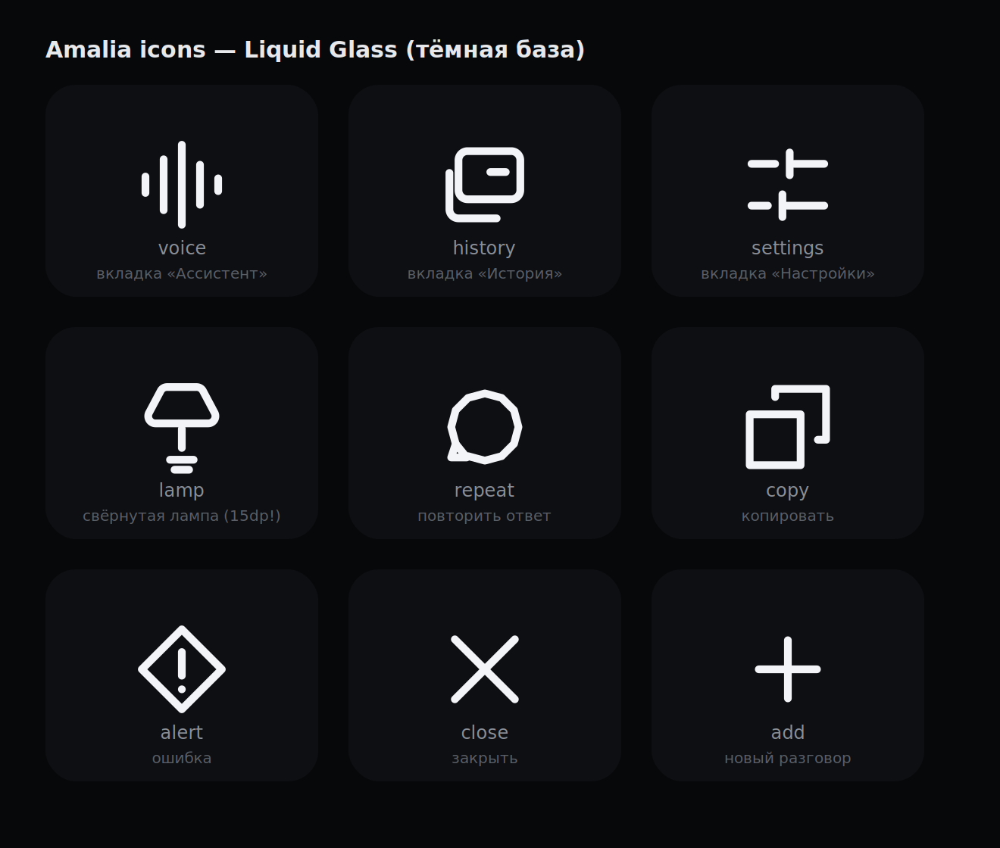

<div align="center">



# Амалия

### Открытый ИИ-голосовой ассистент для Android

*Живая. Отвечает мгновенно. Живёт на твоём телефоне.*

[](https://github.com/kurumi-mProject/amalia/actions)
[](../LICENSE)
[](https://android.com)
[](https://kotlinlang.org)
[](https://developer.android.com/jetpack/compose)
[](https://android.com)

[🌍 Другие языки](../README.md)

<br/>

> Амалия — это не просто ассистент. У неё есть характер.
> 18 лет, уверенная, острая, прямая.
> Не задаёт лишних вопросов. Просто делает.

<br/>



</div>

---

## 📖 О проекте

Амалия — полностью открытый голосовой ассистент для Android, написанный с нуля на современном Kotlin и Jetpack Compose. Проект создан чтобы исследовать пределы скорости и качества AI-пайплайнов на мобильных устройствах в 2026 году.

Весь цикл — от момента, когда ты заканчиваешь говорить, до момента, когда слышишь ответ — занимает **менее одной секунды** в типичных условиях.

Всё прозрачно: исходный код открыт, архитектура задокументирована, ты можешь форкнуть, изменить и строить на основе этого проекта. Единственная просьба: **оставь ссылку на оригинального автора**.

---

## ✨ Возможности

### 🎙️ Распознавание речи
- **Groq Whisper Large v3 Turbo** — лучший STT в своём классе, ~220мс среднее время
- **Silero VAD** — детекция голоса на устройстве, работает полностью офлайн
- Автоматическое определение конца фразы: 600мс тишины = готово
- Нет WebSocket — чистый HTTP-запрос после окончания речи, никаких потерянных слов
- Поддержка русского, английского и режима автоопределения

### 🧠 Мозг ИИ
- **Qwen3 (27B)** на **Groq LPU** — ~150мс до первого токена
- JSON-режим для надёжного вызова инструментов
- Богатый системный промпт — у Амалии есть характер, это не дженерик-бот
- Tool calling: может управлять устройством, запрашивать состояние системы, ставить будильники
- Один API-ключ для STT и LLM (Groq)

### 🔊 Синтез речи
- **Fish Audio `drama-3-preview`** — самая выразительная TTS-модель из доступных
- Сырой PCM 24кГц стриминг — никакого оверхеда от декодирования MP3
- Первый аудио-чанк за ~448–826мс
- `USAGE_ASSISTANT` в AudioTrack — правильный аудиомаршрут на Android
- Независимый `playJob` — TTS никогда не прерывается новым циклом разговора

### 🌗 Циркадный интерфейс
- Цветовая температура UI автоматически меняется в течение дня
- Холодные синие тона утром, тёплый янтарь вечером
- Кастомный `CircadianEngine` — без сторонних библиотек
- Плавные анимированные переходы: Idle → Слушаю → Думаю → Говорю

### 🛠️ Управление устройством
Амалия управляет телефоном голосом:

| Команда | Что делает |
|---|---|
| «Включи вай-фай» | Включает Wi-Fi |
| «Выключи блютуз» | Отключает Bluetooth |
| «Яркость 70%» | Устанавливает яркость экрана |
| «Громче» | Увеличивает громкость медиа |
| «Фонарик включи» | Включает вспышку камеры |
| «Поставь будильник на 7 утра» | Создаёт системный будильник |
| «Таймер на 10 минут» | Запускает обратный отсчёт |
| «Сколько заряда?» | Сообщает уровень батареи |
| «Заряжается?» | Проверяет состояние зарядки |

### 🔒 Приватность и безопасность
- API-ключи в `local.properties` — никогда не попадают в git
- Экран настройки ключей прямо в приложении — не нужно пересобирать
- Никакой аналитики, телеметрии, сбора данных
- VAD полностью на устройстве

---

## ⚡ Производительность

```
🎙️ Ты замолкаешь
        ↓  Silero VAD фиксирует 600мс тишины
        ↓
  Groq Whisper v3 Turbo    ≈ 220мс   (речь → текст)
        ↓
  Qwen3 27B на Groq LPU   ≈ 150мс   (текст → JSON ответ)
        ↓
  Fish Audio drama-3       ≈ 500мс   (текст → первый PCM чанк)
        ↓
🔊 Слышишь голос Амалии
─────────────────────────────────────
  Полная задержка:  ~870мс
```

Все три этапа оптимизированы: TTS начинает стримить до того, как LLM закончил генерировать, а AudioTrack воспроизводит до того, как всё аудио получено.

---

## 🏗️ Архитектура

```
app/src/main/java/com/my/amali/
│
├── core/
│   ├── di/ServiceLocator.kt          — зависимости (без DI-фреймворка)
│   └── navigation/                   — NavHost + BottomNavBar
│
├── data/
│   ├── ai/
│   │   ├── AIOrchestrator.kt         — координатор пайплайна STT→LLM→TTS
│   │   ├── GroqLLM.kt                — LLM-клиент, JSON-режим, tool calling
│   │   ├── GroqWhisperStt.kt         — STT движок, VAD цикл, HTTP к Whisper
│   │   ├── GroqSttClient.kt          — multipart POST к API транскрипции Groq
│   │   ├── SpeechGate.kt             — обёртка над Silero VAD
│   │   ├── VoiceRecorder.kt          — жизненный цикл AudioRecord
│   │   ├── FishAudioTTS.kt           — TTS движок, PCM стриминг
│   │   ├── AudioPlayer.kt            — воспроизведение PCM через AudioTrack
│   │   ├── AmaliaLog.kt              — централизованный логгер (тег: AMALIA)
│   │   ├── AIEngineInterfaces.kt     — SttEvent, AiResponse, EngineOptions
│   │   └── ModelCatalog.kt           — реестр моделей по провайдерам
│   │
│   ├── model/
│   │   ├── Conversation.kt           — модель данных разговора
│   │   └── DeviceStatus.kt           — батарея, громкость, зарядка
│   │
│   └── repository/
│       ├── ConversationRepository.kt — хранение истории разговоров
│       └── SettingsRepository.kt     — настройки через DataStore
│
├── domain/entity/
│   ├── Settings.kt                   — модель настроек приложения
│   └── AppLanguage.kt                — поддерживаемые языки UI
│
├── system/
│   └── SystemControllerHub.kt        — управление устройством
│
└── ui/
    ├── assistant/
    │   ├── AssistantScreen.kt        — главный голосовой экран
    │   ├── AssistantViewModel.kt     — конечный автомат состояний
    │   ├── GreetingHero.kt           — анимированное приветствие на idle
    │   └── GreetingPhrases.kt        — фразы приветствия по времени суток
    │
    ├── settings/                     — все экраны настроек
    ├── history/                      — история разговоров
    ├── onboarding/                   — экраны первого запуска
    ├── components/                   — общие UI-компоненты
    ├── icons/AmaliaIcons.kt          — кастомный SVG-набор иконок
    └── theme/
        ├── CircadianEngine.kt        — цветовая температура по времени
        └── Type.kt                   — типографика
```


---

## 🏗️ Стек технологий

| Слой | Технология | Версия |
|---|---|---|
| Язык | Kotlin | 2.2 |
| UI | Jetpack Compose | BOM 2026.08.00 |
| Дизайн-система | Material 3 | актуальная |
| Архитектура | MVVM + StateFlow | — |
| Асинхронность | Kotlin Coroutines + Flow | — |
| Хранилище | DataStore Preferences | — |
| HTTP | OkHttp | 4.x |
| STT | Groq Whisper Large v3 Turbo | — |
| VAD | Silero VAD (android-vad) | 2.0.9 |
| LLM | Qwen3-27B через Groq LPU | — |
| TTS | Fish Audio drama-3-preview | — |
| Аудио | AudioRecord + AudioTrack | Android |
| Сборка | Gradle | 9.7.1 |
| AGP | Android Gradle Plugin | 9.4.0 |
| Min SDK | Android 8.0 | API 26 |
| Target SDK | Android 16 | API 36 |

---

## 🚀 Запуск

### Что нужно

- Android Studio Meerkat или новее
- JDK 17+
- Android-устройство или эмулятор на Android 8.0+

### Шаг 1 — Клонировать

```bash
git clone https://github.com/kurumi-mProject/amalia.git
cd amalia
```

### Шаг 2 — API-ключи

Нужно два ключа:

**Groq** (STT + LLM) — [console.groq.com](https://console.groq.com)
- Бесплатный тариф: 14 400 секунд STT в сутки + щедрый лимит LLM
- Один ключ на оба сервиса — Whisper и Qwen3

**Fish Audio** (TTS) — [fish.audio](https://fish.audio)
- Бесплатный тариф: 6 млн символов в месяц по Startup Program
- Нужен для голоса Амалии

Создай `local.properties` в корне проекта:

```properties
GROQ_API_KEY=gsk_твой_ключ
FISH_AUDIO_API_KEY=sk-fish-твой_ключ
```

> ⚠️ `local.properties` в `.gitignore` — ключи никогда не попадут в репозиторий.

Ключи также можно ввести прямо в приложении: **Настройки → API и модели**.

### Шаг 3 — Сборка

```bash
./gradlew assembleDebug
```

Или открой в Android Studio и нажми **Run**.

### Шаг 4 — Разрешения

При первом запуске приложение попросит:
- **Микрофон** — необходим для голосового ввода
- **Изменение настроек звука** — нужен для инструмента управления громкостью

---

## 🔧 Настройки

Все параметры доступны в интерфейсе приложения. Пересборка не нужна.

| Настройка | Где |
|---|---|
| Ключ Groq | Настройки → API и модели |
| Ключ Fish Audio | Настройки → API и модели |
| Язык распознавания | Настройки → API и модели |
| Модель LLM | Настройки → API и модели |
| Голос TTS | Настройки → Голос |
| Стиль волны | Настройки → Внешний вид → Волна |
| Циркадная тема | Настройки → Внешний вид |

---

## 📦 Сборка релиза

Проект включает полный CI/CD через GitHub Actions.

### Debug-сборка
Запускается при каждом пуше. APK скачивается из артефактов Actions.

### Release-сборка (AAB + APK)
Запускается при пуше тега версии:

```bash
git tag v1.0.0
git push origin v1.0.0
```

Actions автоматически:
1. Соберёт подписанный AAB для Google Play
2. Соберёт подписанный APK для прямой установки
3. Создаст GitHub Release с обоими файлами

Необходимые GitHub Secrets:

| Секрет | Описание |
|---|---|
| `GROQ_API_KEY` | Ключ Groq API |
| `FISH_AUDIO_API_KEY` | Ключ Fish Audio |
| `AMALIA_KEYSTORE_BASE64` | Keystore в base64 |
| `AMALIA_KEYSTORE_PASSWORD` | Пароль keystore |
| `AMALIA_KEY_ALIAS` | Алиас ключа |
| `AMALIA_KEY_PASSWORD` | Пароль ключа |

---

## 🐛 Отладка

Все этапы пайплайна пишут структурированные логи под тегом `AMALIA`:

```bash
adb logcat -s AMALIA
```

Префиксы модулей:

| Префикс | Модуль |
|---|---|
| `[STT]` | Распознавание речи |
| `[PCM]` | Аудио стриминг |
| `[ORC]` | Оркестратор пайплайна |
| `[VM]` | Конечный автомат ViewModel |
| `[TTS]` | Fish Audio TTS |
| `[TOOL]` | Вызовы инструментов устройства |

---

## 🙏 Спонсоры

<div align="center">

### Голос Амалии — это

<a href="https://fish.audio">
  
</a>

**[Fish Audio](https://fish.audio)** спонсирует технологию голосового синтеза Амалии.

Их модель `drama-3-preview` обеспечивает поразительно живую, выразительную речь — PCM стриминг 24кГц, первый чанк за ~500мс. Без Startup Program Fish Audio Амалия не звучала бы так, как она звучит.

Если ты строишь голосовые приложения — начни с Fish Audio.

</div>

---

## 📜 Открытый исходный код и лицензия

Амалия выпущена под лицензией **MIT**.

```
MIT License — Copyright (c) 2026 kurumi-mProject
```

**Что это значит:**
- ✅ Можно использовать код бесплатно — в личных и коммерческих проектах
- ✅ Можно изменять как угодно
- ✅ Можно распространять свою изменённую версию
- ✅ Можно включать в свои проекты
- ✅ Можно продавать продукты, построенные на основе этого кода

**Одна просьба:**
> Пожалуйста, оставь упоминание оригинального автора — **kurumi-mProject** — в своём README, экране «О программе» или документации. Лицензия этого не требует, но это приятно.

Полный текст лицензии: [LICENSE](../LICENSE)

---

## 🤝 Вклад в проект

Вклад приветствуется. Нашёл баг, есть идея фичи или хочешь улучшить что-то — открывай issue или pull request.

Строгих правил контрибуции пока нет. Будь разумным, держи стиль кода, описывай что делает твой PR.

---

## 📬 Контакты

GitHub: [@kurumi-mProject](https://github.com/kurumi-mProject)

---

<div align="center">

*Сделано с душой · Работает на [Groq](https://groq.com) + [Fish Audio](https://fish.audio)*

</div>
